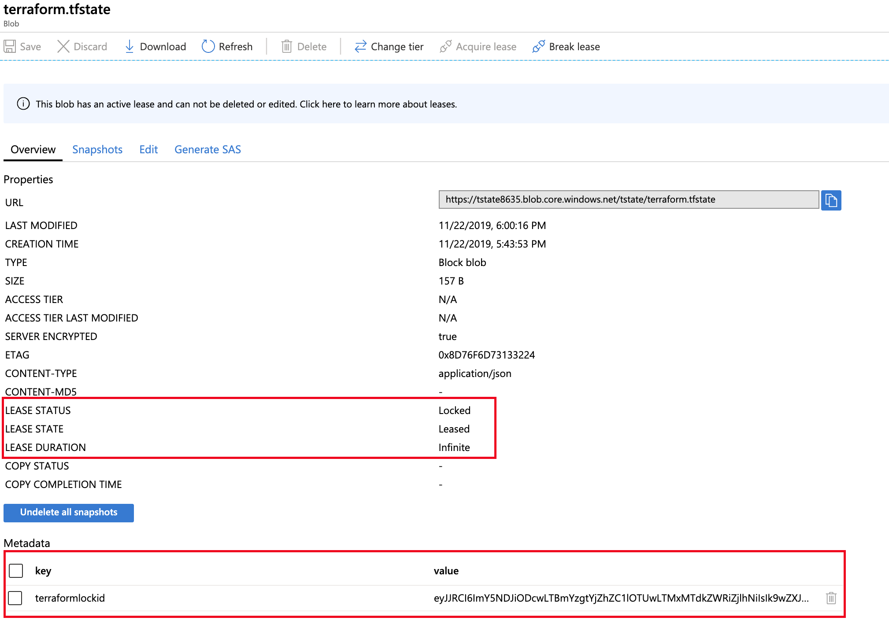

# Challenge 07 - Remote Backend

In this challenge, you will move your state file to a remote backend.

Terraform stores the state of your managed infrastructure from the last time Terraform was run. Terraform uses this state to create plans and make changes to your infrastructure, it is critical that this state is maintained appropriately so future runs operate as expected.

There are 2 types of backends: 
1. **Local State (default):** Stored locally in a JSON format.
2. **Remote State:** stored on a remote source (Azure Storage, Artifactory, Terraform Enterprise, etc). It is best-suited for large or distributed teams

## How to

### Create Azure Storage Account

In the Cloud Shell, create a Storage Account, this storage account will act as the backend for Terraform State. You can get detailed information on how to create an Storage account over CLI [here](https://docs.microsoft.com/en-us/azure/terraform/terraform-backend).

This is a script that will create a Storage Account with a Blob Container for you.

From the Cloud Shell, change directory into a folder specific to this challenge. If you created the scaffolding in Challenge 00, then then you can use the command `cd ~/AzureWorkChallenges/challenge07/` and create a file storage.bash:

```az
#!/bin/bash

RESOURCE_GROUP_NAME=tstate
STORAGE_ACCOUNT_NAME=tstate$RANDOM
CONTAINER_NAME=tstate

# Create resource group
az group create --name $RESOURCE_GROUP_NAME --location eastus

# Create storage account
az storage account create --resource-group $RESOURCE_GROUP_NAME --name $STORAGE_ACCOUNT_NAME --sku Standard_LRS --encryption-services blob

# Create blob container
az storage container create --name $CONTAINER_NAME --account-name $STORAGE_ACCOUNT_NAME 

echo "resource_group: $RESOURCE_GROUP_NAME"
echo "storage_account_name: $STORAGE_ACCOUNT_NAME"
echo "container_name: $CONTAINER_NAME"
```

To execute this file you need to change permissions of it, afterwards execute it:
```sh
chmod 755 ./storage.bash
./storage.bash
```

After you are done, note the outputs resource_group, storage_account_name and container_name as you will need them in the next step.

```sh
...
resource_group: tstate
storage_account_name: tstate23849
container_name: tstate
```

### Configure the Storage Account as Terraform Backend

Update your configuration with the info:

```hcl
terraform {
  backend "azurerm" {
    resource_group_name   = "tstate"
    storage_account_name  = "tstate23849"
    container_name        = "tstate"
    key                   = "terraform.tfstate"
  }
}

resource "azurerm_resource_group" "challenge07" {
  name     = "challenge07"
  location = "eastus"
}
```

Run `terraform init`.

> **CAUTION:** This description is assuming you're either authenticating vie Azure CLI or a Service Principal, a description how to configure an Azure Backend authenticating with a Managed Service Identity (MSI) or an storage Access Key can be found here: https://www.terraform.io/docs/backends/types/azurerm.html

### Validate Folder Structure locally

Execute list directory command to see what files have been created during `terraform init`:
```sh
ls -la
total 16
drwxr-xr-x   5 zeno  staff  160 Nov 22 17:36 .
drwxr-xr-x  11 zeno  staff  352 Nov 20 17:01 ..
drwxr-xr-x   4 zeno  staff  128 Nov 22 15:20 .terraform
-rw-r--r--   1 zeno  staff  554 Nov 22 15:19 main.tf
-rwxrwxr-x   1 zeno  staff  599 Nov 22 17:03 storage.bash
```
### Run Terraform Plan and validate folder structure in Storage Account

Run `terraform plan` and validate folder structrue in the Storage Account via the Azure Portal:


### View Lock State

Run a `terraform apply` and while waiting for `yes` input validate the state file in the portal, notice how a lease is put on it.



## Resources
- [Terraform Azure Backend](https://www.terraform.io/docs/backends/types/azurerm.html)
- [Microsoft Azure Backend for Terraform (https://docs.microsoft.com/en-us/azure/terraform/terraform-backend)

What's next?
==============

Once this section is completed, go back to [the agenda](../../README.md).
