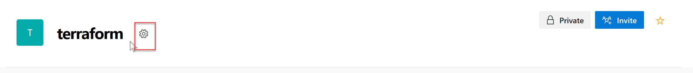
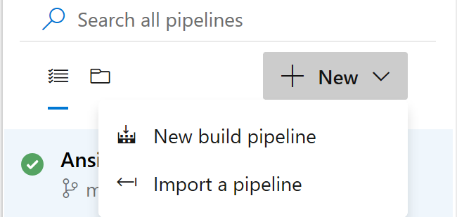

Challenge 09 - Azure Devops
=======

In this challenge, you will connect create a Pipeline in Azure Devops so you can automatically deploy the templates you have been working on so far. 

## How to

## Create a Service Principal

You will need an Azure Active Directory service principal to interact with Azure APIs. The service principal is needed to dynamically manage resources. The easiest way to set up the service principal is using the Azure cloud shell.

> **Note**: To complete this task ensure your account is an [Owner](https://docs.microsoft.com/en-us/azure/role-based-access-control/built-in-roles#owner) built-in role for the subscription you will use and is a [Member](https://docs.microsoft.com/en-us/azure/active-directory/fundamentals/users-default-permissions#member-and-guest-users) user in the Azure AD tenant you will use. You may have trouble creating a service principal if you do not meet these requirements.

To create a service principal, type the following command in the cloud shell command line, replacing {id} with your subscription identifier, and replacing suffix with your chosen suffix to make the name unique:

   ```bash
   az ad sp create-for-rbac --role="Contributor" --scopes="/subscriptions/{id}" --name="http://azuredevops-sp-{SUFFIX}"
   ```

The service principal command will produce output like this. Copy this information; **you will need it later.**

To get the service principal object id, type the following command, replacing {appId} with your service principal appId:

   ```bash
   az ad sp show --id {appId} --query "{objectId:@.objectId}"
   ```

The service principal information command will produce output like this. Copy this information; you will need it later.

   


### Create an Azure DevOps Project

First we will need the templates we worked on previous challenges, in this case we will use the one on Challenge02. 

Open a **new** Azure Cloud Shell console.

Now we are going to configure a repository, first we will do it locally and then we are going to add the contents on Azure DevOps repo. First set your username and email which are used for git commits, use your own information:

   ```bash
   git config --global user.email "you@example.com"
   git config --global user.name "Your Name"
   ```
Configure git CLI to cache your credentials, so that you don't have to keep re-typing them.

   ```bash
   git config --global credential.helper cache
   ```

Open a new browser tab to visit [Azure DevOps][https://dev.azure.com/] and log into your account. If you have never logged into this account, you will be taken through a first-run experience:

   - Confirm your contact information and select next.
   - Select "Create new account".
   - Enter a name for your account name and select Continue.

Now that you have your own Azure Devops Account you will need an Azure DevOps Project.

   - Enter a name for the project.
   - Ensure the project is Private.
   - Choose the Advanced dropdown.
   - Ensure the Version control is set to Git.
   - Select the "Create Project" button.

   

Now you need to enable multi-stage pipelines:

   - Select your user icon in the top right corner.
   - Then choose the three dots to access the "Preview Features" menu item.
   - Toggle multi-stage pipelines to "On".

Next add an Azure Service Connection to your Azure DevOps account. Select the Project settings gear icon to access your settings. Then select Service Connections.

 

Choose "+ New service connection". Then pick "Azure Resource Manager" from the menu.

    

Select the link indicated in the screenshot below to access the advanced settings.


Enter the required information using the service principal information you created earlier.

-**Connection name**: azurecloud
- **Environment**: AzureCloud
- **Subscription ID**: `id` from `az account show` output
- **Subscription Name**: `name` from `az account show` output
- **Service Principal Client ID**: `appId` from service principal output.
- **Service Principal Key**: `password` from service principal output.
- **Tenant ID**: `tenant` from service principal output.

    

Select "Verify connection" then select "OK".

**Note**: If the connection does not verify, then recheck and reenter the required data.

### Initialize Azure Repos

We now have an Azure DevOps environment we now need to add out code to Azure Repos so we can version it and work with it. 

To do that, choose "Repos" then use the repository dropdown to create a new repository by selecting "+ New repository".

 

    - Enter "terraform" as the repository name.
    - Once the project is created select "Generate Git credentials".

    

Copy the Personal Access Token and save it for later steps and click on Initialize.

Using your cloud shell window, initialize a new git repository for `terraform`.

    ```bash
    cd challenge09
    code main.tf
    ```
Add the following code to the main.tf file: 

```yaml
provider "azurerm" {
  version = "=1.36.0"
}

resource "azurerm_resource_group" "test" {
  name     = "production"
  location = "West US"
}

resource "azurerm_virtual_network" "test" {
  name                = "production-network"
  resource_group_name = "${azurerm_resource_group.test.name}"
  location            = "${azurerm_resource_group.test.location}"
  address_space       = ["10.0.0.0/16"]
}

```
```
    git init
    git add .
    git commit -m "Initial Commit"
```

Return to your Azure DevOps tab and copy the commands to add your Azure DevOps repository as a new remote for push. Copy the commands for "**HTTPS**" similar to this example:

    ```bash
    git remote add origin https://<username>@dev.azure.com/<username>/<project/_git/<reponame>
    git push -f -u origin --all
    ```

Now use the commands copied from Azure DevOps to configure the remote repository and push the code to Azure DevOps. When prompted for a password, paste your Azure DevOps Personal Access Token you copied earlier in this task.


### Create the Pipeline

Next create the build Pipeline. Go to `Azure Pipelines`, select `Build` and click on `+New` and select `New Build Pipeline`



Select `Use Classic Editor`


Select `Azure Repos` as your source and provide the details of the repo you just created. 

Select `Empty Job`


Click on `Agent Job 01` and provide the following details: 
    - Display Name: Terraform 
    - Agent Pool: Azure Pipelines
    - Agent Specification: ubuntu-18.04

Click on the `+`sign next to the Agent Job 


Now we are going to start adding tasks to the pipeline. First, we need to run init, on the search box look for `Terraform` and select the `Terraform CLI` use the one by Chales Zipp and click on `Add`


Now that this is done let's configure the task, select the one you just added and provide the information as follows: 
    - Display Name: Terraform Init
    - Command: init
    - Configuration Directory: $(System.DefaultWorkingDirectory)
    - Backend Type: azurerm

Expand the AzureRM Backend Configuration and provide the configuration of the storage account you created in challenge07. Add a new empty container on the storage account and use that one to avoid conflicts with previously created files: 
    - Backend Azure Subscription: select the one you have been using
    - Resource Group Name: the one use for the storage account in challenge 07
    - Resource Group Location: the one use for the storage account in challenge 07
    - Storage Account Name: the one use for the storage account in challenge 07
    - Storage Account SKU: Standard_LRS
    - Container Name: the new container you created
    - Key: tf

Add another task the same way you did before, and use the same `Terraform CLI` use the one by Chales Zipp. Select the task you just added and provide the information as follows: 
    - Display Name: Terraform Plan
    - Command: plan
    - Configuration Directory: $(System.DefaultWorkingDirectory)
    - Environment Subscription: select the one you have been working on

Once again, add another task the same way you did before, and use the same `Terraform CLI` use the one by Chales Zipp. Select the task you just added and provide the information as follows: 
    - Display Name: Terraform Apply
    - Command: apply
    - Configuration Directory: $(System.DefaultWorkingDirectory)
    - Environment Subscription: select the one you have been working on

Click on `Save and Queue`

   

The build should take a couple of minutes to complete.

   

 
When you are finished editing, select `Run` to execute the pipeline.

Review in the Azure Portal nothing must have been created so far since we have not ran `terraform apply`

### Deploy the infrastructure

Now that we have the deployment planned we need to apply it for that we will use a release pipeline. 

What's next?
==============

Once this section is completed, go back to [the agenda](../../README.md).